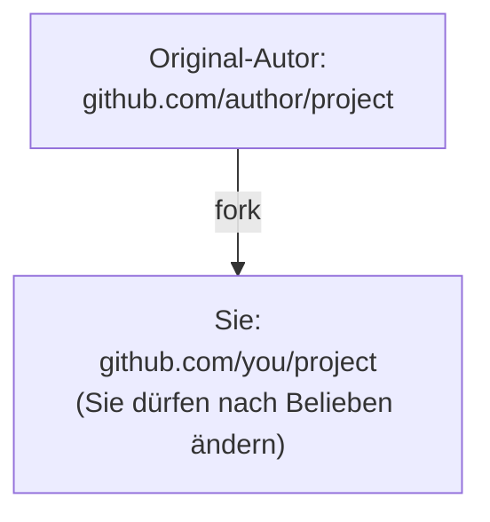

# fork und upstream synchronisieren

## Lektionsziele

- Die Rolle von fork in der Open-Source-Zusammenarbeit verstehen
- Mit git remote add upstream das Repository des Original-Autors anbinden
- Mit fetch + merge Upstream-Updates synchronisieren

## Was ist ein fork

Ein fork (Abspaltung) kopiert das Repository eines anderen auf GitHub in Ihr eigenes Konto:



fork ist eine Funktion von GitHub (kein git-Befehl). Der Unterschied zu clone: fork erstellt eine Kopie auf den GitHub-Servern, clone kopiert das Repository auf Ihren Rechner. Der typische Open-Source-Ablauf ist „erst forken, dann den eigenen fork klonen" — Sie haben keine Schreibrechte am Repository des Original-Autors und arbeiten daher nur in Ihrer Kopie.

## Deinen fork klonen

Nach dem Klick auf Fork auf GitHub klonen Sie das Repository, das unter Ihrem Kontonamen liegt:

```bash
git clone https://github.com/you/project.git
cd project
git remote -v
```

`git remote -v` zeigt ein Remote: `origin` zeigt auf Ihren fork. Sie können also nur origin lesen und schreiben — die Updates des Original-Autors erscheinen noch nicht automatisch.

## upstream-Remote hinzufügen

Registrieren Sie das Repository des Original-Autors als zweites Remote — die Konvention nennt es `upstream`:

```bash
git remote add upstream https://github.com/author/project.git
git remote -v
```

Jetzt gibt es zwei Remotes: `origin` (Ihr fork, lesbar und beschreibbar) und `upstream` (Repository des Original-Autors, nur zum Empfangen von Updates). Diese Rollentrennung zu verinnerlichen ist der Kern des fork-Workflows.

## Mit upstream synchronisieren

Der Upstream entwickelt sich ständig weiter; so bleibt Ihr fork auf dem Laufenden:

```bash
git switch main
git fetch upstream
git merge upstream/main
git push origin main
```

- `git fetch upstream` lädt die Upstream-Commits herunter (lokal bleibt alles unverändert)
- `git merge upstream/main` (oder rebase) verbindet die Updates mit dem lokalen main
- `git push origin main` synchronisiert die Updates auf den fork auf GitHub

So bleibt der fork konsistent mit dem Repository des Original-Autors — danach können Sie auf dem neuesten Stand einen Branch erstellen und beitragen.

## Übungen zum Mitmachen

- Forken Sie ein Open-Source-Repository, das Sie regelmäßig nutzen, auf GitHub
- Klonen Sie es, fügen Sie upstream hinzu und führen Sie eine Synchronisierung durch
- Beobachten Sie auf der Seite Issues, wie andere zusammenarbeiten

## Übungen

<Exercise />

<LessonProgress />
