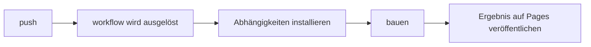

# GitHub Actions und Pages

## Lektionsziele

- Verstehen, was Actions ist und wie Ereignisse Workflows auslösen
- Die Struktur einer Workflow-Datei lesen können
- Wissen, wie Actions GitHub Pages bereitstellen

## Was sind Actions

GitHub Actions ist die eingebaute CI/CD: Ereignisse im Repository (push, pull_request, geplant, manuell) lösen automatisierte Aufgaben aus — Tests ausführen, bauen, veröffentlichen, deployen. Die Kursseite, die Sie gerade ansehen, wird von Actions gebaut und auf Pages bereitgestellt.

## workflow-Dateien

Ein Workflow wird in einer YAML-Datei unter `.github/workflows/` definiert (z. B. deploy.yml):

```yaml
name: Deploy
on:
  push:
    branches: [main]
jobs:
  build:
    runs-on: ubuntu-latest
    steps:
      - uses: actions/checkout@v4
      - run: npm ci && npm run build
      - uses: actions/upload-pages-artifact@v3
```

Die Struktur: `on` deklariert die auslösenden Ereignisse; `jobs` definiert die Aufgaben (parallel ausführbar, jede auf einer eigenen Maschine); `steps` sind die einzelnen Schritte einer Aufgabe (`run` führt einen Befehl aus, `uses` nutzt ein fertiges action aus der Community wieder).

## Häufige Auslöser

- `push`: wird beim Pushen ausgelöst (auf bestimmte Branches einschränkbar)
- `pull_request`: bei Eröffnung oder Update eines PR
- `schedule`: zeitgesteuert (cron-Syntax)
- `workflow_dispatch`: per Klick manuell auslösen

## GitHub Pages bereitstellen

Für das Pages-Deployment gibt es zwei Wege: Nach dem Aktivieren von Pages in den Repository-Einstellungen direkt einen Branch veröffentlichen, oder mit Actions ein Build-Ergebnis veröffentlichen. Letzteres ist häufiger (erst Tests und Build ausführen, dann das Ergebnis auf Pages veröffentlichen):



Deployment-Status, Logs und Fehlerursachen finden Sie im Tab Actions des Repositorys. Das kleine grüne Häkchen (✓/✗) neben Commits ist der Einstieg zur Prüfung.

## Übungen zum Mitmachen

- Erstellen Sie in Ihrem Repository `.github/workflows/deploy.yml` und deployen Sie eine statische Seite
- Bauen Sie den Build-Schritt absichtlich falsch und beobachten Sie das Fehlerlog von Actions
- Fügen Sie Ihrem Übungs-Repository einen Workflow hinzu, der Tests ausführt

## Übungen

<Exercise />

<LessonProgress />
