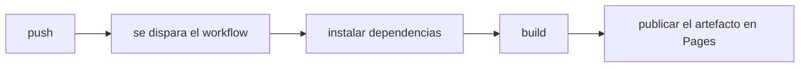

# GitHub Actions y Pages

## Objetivos de la lección

- Entender qué es Actions y cómo los eventos disparan los workflows
- Leer la estructura de un archivo de workflow
- Conocer el despliegue de GitHub Pages con Actions

## Qué es Actions

GitHub Actions es el CI/CD integrado: los eventos del repositorio (push, pull_request, programación, manual) disparan tareas automáticas — ejecutar pruebas, construir, publicar, desplegar. El sitio de este curso que estás viendo lo construye Actions y lo despliega en Pages.

## El archivo de workflow

El workflow se define en un archivo YAML dentro de `.github/workflows/` (por ejemplo deploy.yml):

```yaml
name: Deploy
on:
  push:
    branches: [main]
jobs:
  build:
    runs-on: ubuntu-latest
    steps:
      - uses: actions/checkout@v4
      - run: npm ci && npm run build
      - uses: actions/upload-pages-artifact@v3
```

Estructura: `on` declara los eventos que lo disparan; `jobs` define las tareas (pueden ir en paralelo, cada una en una máquina); `steps` son las acciones paso a paso de cada tarea (`run` ejecuta un comando, `uses` reutiliza una action ya escrita por la comunidad).

## Eventos de disparo habituales

- `push`: se dispara al hacer push (puede limitarse a una rama)
- `pull_request`: cuando se abre o actualiza un PR
- `schedule`: disparo programado (sintaxis cron)
- `workflow_dispatch`: disparo manual con un clic

## Desplegar GitHub Pages

Para desplegar en Pages hay dos caminos: activar Pages en los ajustes del repositorio y publicar directamente una rama, o usar Actions para publicar el artefacto del build. El segundo es el más usado (primero se ejecutan las pruebas y el build, después se publica el resultado en Pages):



El estado del despliegue, los logs y los fallos están en la pestaña Actions del repositorio. La pequeña marca verde al lado del commit (✓/✗) es la puerta de entrada al resultado de las comprobaciones.

## Manos a la obra

- Crea `.github/workflows/deploy.yml` en tu repositorio y despliega una página estática
- Rompe a propósito el paso de build y observa el log de fallo de Actions
- Añade a tu repositorio de práctica un workflow que ejecute las pruebas

## Ejercicios

<Exercise />

<LessonProgress />
