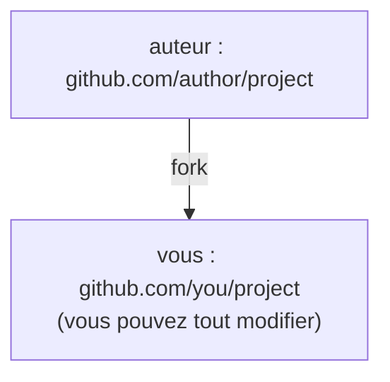

# fork et synchronisation upstream

## Objectifs de la leçon

- comprendre le rôle de fork dans la collaboration open source
- ajouter le dépôt de l'auteur avec git remote add upstream
- synchroniser les mises à jour de l'amont avec fetch + merge

## Qu'est-ce qu'un fork ?

Un fork (dérivation) copie le dépôt de quelqu'un d'autre dans votre propre compte GitHub :



fork est une fonctionnalité de GitHub (pas une commande git). La différence avec clone : fork crée une copie sur les serveurs de GitHub, clone copie le dépôt sur votre ordinateur. Le flux open source typique est « d'abord fork, puis clone de son fork » — vous n'avez pas les droits d'écriture sur le dépôt de l'auteur, vous ne pouvez travailler que sur votre copie.

## Cloner votre fork

Après avoir cliqué sur Fork dans GitHub, clonez le dépôt qui porte votre nom :

```bash
git clone https://github.com/you/project.git
cd project
git remote -v
```

`git remote -v` affiche un remote : `origin` pointe vers votre fork. Vous ne pouvez lire et écrire que origin — les mises à jour du dépôt de l'auteur n'apparaissent pas automatiquement.

## Ajouter le remote upstream

Enregistrez le dépôt de l'auteur comme deuxième remote, par convention nommé `upstream` :

```bash
git remote add upstream https://github.com/author/project.git
git remote -v
```

Il y a maintenant deux remotes : `origin` (votre fork, lecture/écriture) et `upstream` (le dépôt de l'auteur, lecture seule pour recevoir les mises à jour). Retenir la répartition des rôles est le cœur du workflow fork.

## Se synchroniser avec upstream

L'amont évolue en permanence, pour que le fork suive le rythme :

```bash
git switch main
git fetch upstream
git merge upstream/main
git push origin main
```

- `git fetch upstream` télécharge les commits de l'amont (sans toucher au local)
- `git merge upstream/main` (ou rebase) raccorde les mises à jour à main en local
- `git push origin main` synchronise le fork sur GitHub

Ainsi le fork reste aligné sur le dépôt de l'auteur, et vous pouvez ensuite créer des branches et contribuer sur du code à jour.

## Exercices pratiques

- fork sur GitHub un dépôt open source que vous utilisez souvent
- clonez-le, ajoutez upstream, effectuez une synchronisation
- observez sur la page Issues comment les autres collaborent

## Exercices

<Exercise />

<LessonProgress />
