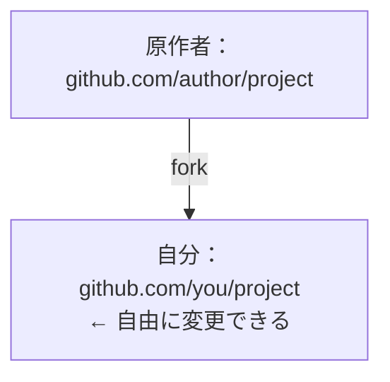

# fork と upstream の同期

## この課の目標

- fork がオープンソース協働で果たす役割を理解する
- git remote add upstream で原作者のリポジトリを登録する
- fetch + merge で上流の更新を同期する

## fork とは

fork（フォーク）は、GitHub 上で他人のリポジトリを自分のアカウントに複製する機能です：



fork は GitHub の機能（git コマンドではない）です。clone との違い：fork は GitHub サーバー上にコピーを作り、clone はリポジトリをローカルのパソコンに複製します。典型的なオープンソースの流れは「まず fork、次に自分の fork を clone」——原作者のリポジトリには書き込み権限がないので、自分のコピーで作業します。

## 自分の fork を clone する

GitHub で Fork を押したら、自分のアカウント名義のリポジトリを clone します：

```bash
git clone https://github.com/you/project.git
cd project
git remote -v
```

`git remote -v` は 1 つのリモートを表示します：`origin` は自分の fork を指します。この時点で読み書きできるのは origin だけ——原作者のリポジトリの更新は自動では現れません。

## upstream リモートの追加

原作者のリポジトリを 2 つ目のリモートとして登録します。慣例では `upstream` と呼びます：

```bash
git remote add upstream https://github.com/author/project.git
git remote -v
```

これで 2 つの remote があります：`origin`（自分の fork、読み書き可）と `upstream`（原作者のリポジトリ、更新を受け取る専用）。この 2 つの役割分担を覚えることが fork ワークフローの核心です。

## 上流との同期

上流は常に更新されています。fork を最新に保つには：

```bash
git switch main
git fetch upstream
git merge upstream/main
git push origin main
```

- `git fetch upstream` は上流のコミットをダウンロードする（ローカルは変更しない）
- `git merge upstream/main`（または rebase）で更新をローカルの main に取り込む
- `git push origin main` で更新を GitHub 上の fork に同期する

こうして fork を原作者のリポジトリと同じ状態に保ち、最新のコードの上でブランチを切り、貢献できます。

## 実践してみよう

- GitHub でよく使うオープンソースのリポジトリを fork する
- それを clone し、upstream を追加して同期を 1 回実行する
- Issues ページで他の人がどう協働しているか観察する

## 練習

<Exercise />

<LessonProgress />
