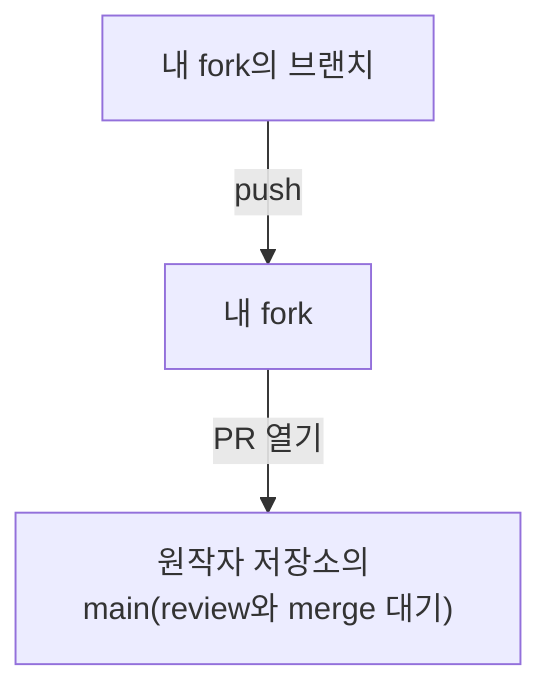

# Pull Request 워크플로

## 이번 과의 목표

- 협업에서 PR이 하는 역할 이해하기
- 「브랜치 만들기 → push → PR 열기 → 토론 → 병합」 전체 흐름 경험하기
- 세 가지 병합 방식과 PR 브랜치 업데이트 이해하기

## pull request란 무엇인가

Pull Request(PR)는「내 커밋을 당신의 저장소에 병합해 주세요」라는 공식 요청입니다. 남의 저장소에 직접 쓸 권한은 없지만, PR을 제출하면 유지보수자(maintainer)가 review 후 병합 여부를 결정합니다:



PR은 커밋만 있는 게 아닙니다: 코드 비교(diff), 토론, 자동 검사(CI) 결과까지 포함하며, 오픈소스 협업의 핵심 단위입니다.

## PR 열기

전제: 작업 브랜치를 내 fork로 push합니다:

```bash
git switch -c fix/login-bug
git commit -am "fix: login bug"
git push origin fix/login-bug
```

GitHub로 돌아가면 저장소 페이지에 Compare & pull request 버튼이 나타납니다. base(대상 브랜치, 예: 원작자 저장소의 main)와 compare(내 브랜치)를 고르고, 제목과 설명을 작성해 PR을 만듭니다.

## review와 토론

PR은 토론의 현장입니다: 유지보수자는 특정 코드 줄에 댓글(line comments)을 달고, 수정 요청(request changes)을 하거나 승인(approve)할 수 있습니다. 내가 새 커밋을 올릴 때마다 토론 흐름에 반영되며, 해결한 뒤 @멘션으로 재검토를 요청할 수 있습니다.

## 병합과 닫기

병합에는 세 가지 방식이 있고 역사가 각각 다릅니다:

| 방식 | 역사 |
| --- | --- |
| Create a merge commit | 분기를 유지하고 머지 커밋을 만든다 |
| Squash and merge | 전부 하나의 커밋으로 압축한다 |
| Rebase and merge | 선형으로 재생, 머지 커밋 없음 |

병합 후 GitHub는 보통 그 브랜치 삭제를 권장합니다. PR은 병합 없이 닫힐(closed) 수도 있습니다 — 예를 들어 방안을 포기한 경우입니다.

## PR 브랜치 업데이트

유지보수자가 수정을 요구해도 PR을 다시 만들 필요가 없습니다. 브랜치에 계속 커밋하고 push하면 PR이 자동으로 업데이트됩니다:

```bash
git commit -am "fix: address review feedback"
git push origin fix/login-bug
```

## 직접 해보기

- GitHub에서 기능 브랜치를 push하고, 저장소에 실제 PR을 하나 제출하세요
- PR에서 특정 코드 줄에 댓글을 달아 토론 흐름을 경험하세요
- 세 가지 병합 방식이 다른 역사를 만드는지 비교해 보세요

## 연습

<Exercise />

<LessonProgress />
