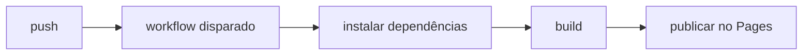

# GitHub Actions e Pages

## Objetivos da lição

- Entender o que é o Actions e como eventos disparam workflows
- Ler a estrutura de um arquivo de workflow
- Conhecer o deploy do GitHub Pages com Actions

## O que é o Actions

O GitHub Actions é o CI/CD embutido do GitHub: eventos do repositório (push, pull_request, agendamento, manual) disparam tarefas automatizadas — rodar testes, construir, publicar, fazer deploy. O site de curso que você está vendo agora é construído pelo Actions e publicado no Pages.

## O arquivo de workflow

Os workflows são definidos em arquivos YAML dentro de `.github/workflows/` (ex.: deploy.yml):

```yaml
name: Deploy
on:
  push:
    branches: [main]
jobs:
  build:
    runs-on: ubuntu-latest
    steps:
      - uses: actions/checkout@v4
      - run: npm ci && npm run build
      - uses: actions/upload-pages-artifact@v3
```

Estrutura: `on` declara os eventos que disparam; `jobs` define as tarefas (podem rodar em paralelo, cada uma em uma máquina); `steps` são as ações dentro da tarefa (`run` executa comandos, `uses` reutiliza uma action pronta da comunidade).

## Eventos de gatilho comuns

- `push`: dispara ao enviar (dá para limitar por branch)
- `pull_request`: quando um PR é aberto ou atualizado
- `schedule`: disparo por agendamento (sintaxe de cron)
- `workflow_dispatch`: disparo manual, com um clique

## Deploy do GitHub Pages

Há dois caminhos para o Pages: publicar o branch direto depois de ativar o Pages nas configurações do repositório, ou usar Actions para publicar o build. O segundo é mais comum (primeiro roda os testes e o build, depois publica o resultado no Pages):



O status do deploy, os logs e o motivo de falha ficam na aba Actions do repositório. O sinalzinho verde ao lado dos commits (✓/✗) é a porta de entrada para ver o resultado das verificações.

## Mão na massa

- Crie `.github/workflows/deploy.yml` no repositório para publicar uma página estática
- Quebre o passo de build de propósito e observe o log de erro no Actions
- Adicione um workflow que roda testes no seu repositório de exercícios

## Exercícios

<Exercise />

<LessonProgress />
