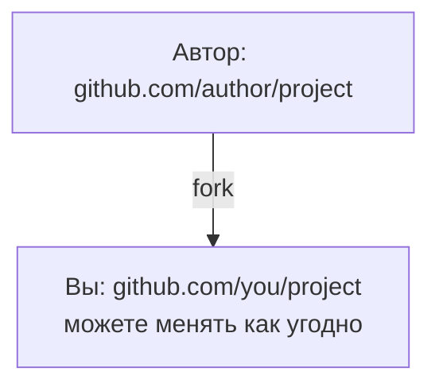

# fork и синхронизация с upstream

## Цели урока

- Понять роль fork в open source
- Подключить репозиторий автора через git remote add upstream
- Синхронизировать обновления через fetch + merge

## Что такое fork

fork — это копия чужого репозитория в вашем аккаунте на GitHub:



fork — это функция GitHub (а не команда git). Отличие от clone: fork создаёт копию на сервере GitHub, а clone копирует репозиторий на локальный компьютер. Типичный open source процесс — «сначала fork, потом clone своего fork»: у вас нет права записи в репозиторий автора, поэтому работать можно только в своей копии.

## Клонирование своего fork

После нажатия Fork на GitHub клонируйте репозиторий из своего аккаунта:

```bash
git clone https://github.com/you/project.git
cd project
git remote -v
```

`git remote -v` показывает один remote: `origin` указывает на ваш fork. Пока вы можете читать и писать только в origin — обновления репозитория автора сами не появятся.

## Добавление upstream remote

Зарегистрируйте репозиторий автора как второй remote, по традиции он называется `upstream`:

```bash
git remote add upstream https://github.com/author/project.git
git remote -v
```

Теперь два remote: `origin` (ваш fork, чтение и запись) и `upstream` (репозиторий автора, только приём обновлений). Помнить, кто чем занимается, — ядро fork-процесса.

## Синхронизация с upstream

Upstream постоянно обновляется, чтобы fork не отставал:

```bash
git switch main
git fetch upstream
git merge upstream/main
git push origin main
```

- `git fetch upstream` скачивает коммиты из upstream (локально ничего не меняет)
- `git merge upstream/main` (или rebase) подключает обновления к локальной main
- `git push origin main` синхронизирует fork на GitHub

Так fork остаётся на уровне репозитория автора — после этого можно создавать ветки и делать вклад на базе свежего кода.

## Практика на реальном GitHub

- Сделайте fork часто используемого вами open source репозитория
- Склонируйте его, добавьте upstream, выполните одну синхронизацию
- Посмотрите на странице Issues, как сотрудничают другие

## Упражнения

<Exercise />

<LessonProgress />
