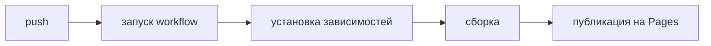

# GitHub Actions и Pages

## Цели урока

- Понять, что такое Actions и как события запускают workflow
- Разбираться в структуре файла workflow
- Узнать, как с помощью Actions развернуть GitHub Pages

## Что такое Actions

GitHub Actions — это встроенный CI/CD: события в репозитории (push, pull_request, по расписанию, вручную) запускают автоматические задачи — тесты, сборку, публикацию, развёртывание. Этот учебный сайт, который вы сейчас читаете, как раз собран и развёрнут Actions на Pages.

## workflow файл

Workflow определяется YAML-файлом в `.github/workflows/` (например, deploy.yml):

```yaml
name: Deploy
on:
  push:
    branches: [main]
jobs:
  build:
    runs-on: ubuntu-latest
    steps:
      - uses: actions/checkout@v4
      - run: npm ci && npm run build
      - uses: actions/upload-pages-artifact@v3
```

Структура: `on` объявляет события-триггеры; `jobs` определяет задачи (могут идти параллельно, каждая на своей машине); `steps` — это шаги внутри задачи (`run` выполняет команды, `uses` переиспользует готовый action из сообщества).

## Частые события-триггеры

- `push`: запускается при отправке (можно ограничить веткой)
- `pull_request`: при открытии или обновлении PR
- `schedule`: по расписанию (синтаксис cron)
- `workflow_dispatch`: по нажатию вручную

## Развертывание GitHub Pages

Два пути: включить Pages в настройках репозитория и публиковать ветку напрямую либо собирать результат через Actions. Второй способ популярнее (сначала тесты и сборка, потом публикация на Pages):



Статус развёртывания, логи и причины ошибок — на вкладке Actions репозитория. Маленькая галочка (✓/✗) рядом с коммитом — вход к просмотру результатов проверки.

## Практика на реальном GitHub

- Создайте в репозитории `.github/workflows/deploy.yml` и разверните статическую страницу
- Намеренно сломайте шаг сборки и посмотрите на лог ошибки в Actions
- Добавьте в свой тренировочный репозиторий workflow с запуском тестов

## Упражнения

<Exercise />

<LessonProgress />
