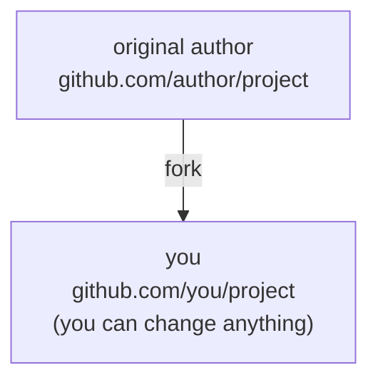

# fork and upstream sync

## Lesson goals

- Understand the role of fork in open-source collaboration
- Attach the original author's repository with git remote add upstream
- Sync upstream updates with fetch + merge

## what is a fork

A fork copies someone else's repository into your own GitHub account:



fork is a GitHub feature (not a git command). The difference from clone: a fork creates a copy on GitHub's servers, a clone copies the repository to your local computer. The typical open-source flow is "fork first, then clone your own fork" — you have no write access to the original author's repository, so you work on your own copy.

## cloning your own fork

After clicking Fork on GitHub, clone the copy under your account:

```bash
git clone https://github.com/you/project.git
cd project
git remote -v
```

`git remote -v` shows one remote: `origin`, pointing to your fork. You can read and write origin — but updates from the original author will not appear automatically.

## adding the upstream remote

Register the original author's repository as a second remote, conventionally called `upstream`:

```bash
git remote add upstream https://github.com/author/project.git
git remote -v
```

Now you have two remotes: `origin` (your fork, read/write) and `upstream` (the original repository, read-only for receiving updates). Knowing what each role is for is the heart of the fork workflow.

## syncing with upstream

The upstream keeps moving. To keep your fork in step:

```bash
git switch main
git fetch upstream
git merge upstream/main
git push origin main
```

- `git fetch upstream` downloads upstream commits (without touching your work)
- `git merge upstream/main` (or rebase) attaches the updates to your local main
- `git push origin main` syncs the copy on GitHub

Now your fork matches the original repository, and you can start new branches from the latest code.

## Practice on real GitHub

- Fork an open-source repository you use often
- Clone it, add upstream, and complete one sync
- Browse its Issues page and observe how people collaborate

## Exercise

<Exercise />

<LessonProgress />
