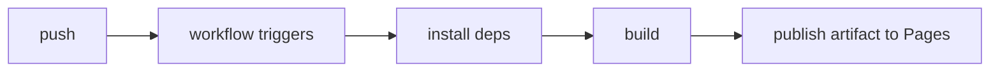

# GitHub Actions and Pages

## Lesson goals

- Understand what Actions is and how events trigger workflows
- Read the structure of a workflow file
- Learn to deploy GitHub Pages with Actions

## what is Actions

GitHub Actions is built-in CI/CD: events in your repository (push, pull_request, schedule, manual) trigger automated jobs — running tests, building, publishing, deploying. The course site you are reading right now is built by Actions and deployed to Pages.

## the workflow file

Workflows live in `.github/workflows/` as YAML files (e.g. deploy.yml):

```yaml
name: Deploy
on:
  push:
    branches: [main]
jobs:
  build:
    runs-on: ubuntu-latest
    steps:
      - uses: actions/checkout@v4
      - run: npm ci && npm run build
      - uses: actions/upload-pages-artifact@v3
```

Structure: `on` declares the triggering events; `jobs` defines tasks (they run in parallel, each on its own machine); `steps` are the individual actions inside a job (`run` executes commands, `uses` reuses a community-maintained action).

## common trigger events

- `push`: on push (can be limited to specific branches)
- `pull_request`: when a PR is opened or updated
- `schedule`: on a timer (cron syntax)
- `workflow_dispatch`: manual trigger via a button

## deploying github pages

There are two ways to deploy Pages: publish a branch directly from repository settings, or publish build artifacts via Actions. The latter is more common (tests and build first, then publish the artifact to Pages):



Deployment status, logs, and failures live in the Actions tab of the repository. The little green check (✓/✗) next to commits is the entry point to check results.

## Practice on real GitHub

- Create `.github/workflows/deploy.yml` in a repository and deploy a static page
- Break the build step on purpose and watch the failure log
- Add a test-running workflow to your practice repository

## Exercise

<Exercise />

<LessonProgress />
