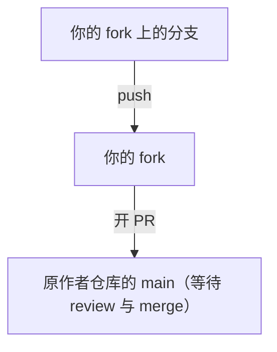

# Pull Request 工作流

## 本课目标

- 理解 PR 在协作中的角色
- 走通「开分支 → 推送 → 开 PR → 讨论 → 合并」全流程
- 了解三种合并方式与 PR 分支的更新

## pull request 是什么

Pull Request（PR）是「请把我的提交合入你的仓库」的正式请求。你无权限直接往别人仓库写，但可以提交 PR，由维护者 review 后决定是否合并：



PR 不止是提交：它包含代码对比（diff）、讨论、自动检查（CI）结果，是开源协作的核心环节。

## 开一个 PR

前提：把工作分支推送到你的 fork：

```bash
git switch -c fix/login-bug
git commit -am "fix: login bug"
git push origin fix/login-bug
```

回到 GitHub，仓库页面会出现 Compare & pull request 按钮。选择 base（目标分支，如原作者仓库的 main）与 compare（你的分支），写标题与描述，创建 PR。

## review 与讨论

PR 是讨论现场：维护者可以对具体代码行留言（line comments）、要求修改（request changes）或批准（approve）。你的每次新提交都会进入讨论流，解决之后可以 @ 对方再审。

## 合并与关闭

合并有三种方式，历史各不相同：

| 方式 | 历史 |
| --- | --- |
| Create a merge commit | 保留分叉，产生合并提交 |
| Squash and merge | 全部压成一个提交 |
| Rebase and merge | 线性重放，无合并提交 |

合并后 GitHub 通常会建议删除该分支。PR 也可能被直接关闭（closed）而不合并——比如方案被放弃。

## 更新 PR 分支

维护者要求修改时，不需要重开 PR：在分支上继续提交并 push，PR 自动更新：

```bash
git commit -am "fix: address review feedback"
git push origin fix/login-bug
```

## 动手练习

- 在 GitHub 上推送一个功能分支，向仓库提交一个真实的 PR
- 在 PR 中对某一行代码留评论，体验讨论流程
- 对比三种合并方式产生不同的历史

## 练习

<Exercise />

<LessonProgress />
