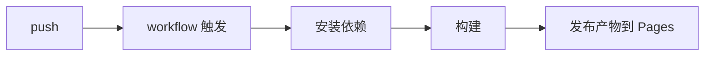

# GitHub Actions 与 Pages

## 本课目标

- 理解 Actions 是什么、事件如何触发工作流
- 读懂 workflow 文件的结构
- 了解用 Actions 部署 GitHub Pages

## Actions 是什么

GitHub Actions 是内置的 CI/CD：仓库里的事件（push、pull_request、定时、手动）触发自动化任务——跑测试、构建、发布、部署。你正在看的这个课程网站，就是 Actions 构建并部署到 Pages 的。

## workflow 文件

工作流定义在 `.github/workflows/` 下的 YAML 文件（如 deploy.yml）：

```yaml
name: Deploy
on:
  push:
    branches: [main]
jobs:
  build:
    runs-on: ubuntu-latest
    steps:
      - uses: actions/checkout@v4
      - run: npm ci && npm run build
      - uses: actions/upload-pages-artifact@v3
```

结构：`on` 声明触发事件；`jobs` 定义任务（可并行，各跑在一台机器上）；`steps` 是任务里的一步步动作（`run` 执行命令，`uses` 复用社区写好的 action）。

## 常用触发事件

- `push`：推送时触发（可限定分支）
- `pull_request`：PR 打开或更新时
- `schedule`：定时触发（cron 语法）
- `workflow_dispatch`：手动点击触发

## 部署 GitHub Pages

Pages 部署有两条路：在仓库设置里开启 Pages 后直接发布分支，或用 Actions 构建产物。后者更常用（先跑测试与构建，再把产物发布到 Pages）：



部署状态、日志与失败原因都在仓库的 Actions 标签页里。提交旁边的小绿勾（✓/✗）是检查运行结果的入口。

## 动手练习

- 在仓库创建 `.github/workflows/deploy.yml` 部署一个静态页面
- 故意写错构建步骤，观察 Actions 的失败日志
- 为你的练习仓库加一个运行测试的工作流

## 练习

<Exercise />

<LessonProgress />
